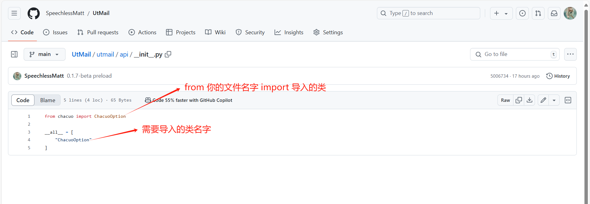

# ⚠ 开发注意事项
## 通过git clone拉取库
开发文档

## 完成开发之后
完成您的api接口开发之后，请在本项目提交commit，但是提交前，您还有一件事要做
## 修改api目录下的__init__.py

```python
from chacuo import ChacuoOption
# 模仿上面 导入你的类名
from example import ExampleOption

# 如下，添加ExampleOption
__all__ = [
    "ChacuoOption",
    "ExampleOption"
]
```


## 提交
在 **utmail/api/** 下提交您的example.py，并修改 **utmail/api/** 下的__init__.py后commit即可

提交你的commit吧！🎇🍗😊我们非常希望见到您的commit.