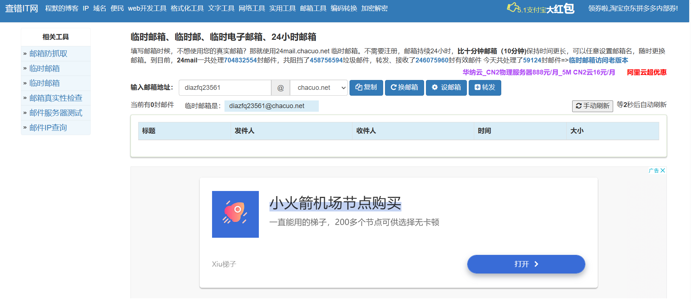

# 📫UtMail 临时邮箱
这是一个可以适配多个接口的开源库，通过一个标准的方法，你可以随心所欲地调用开发者适配好的接口

- 例如已经适配好的[十分钟邮箱](http://24mail.chacuo.net/)



<blockquote>
    <p dir="auto">
本项目/utmail/api文件中含有chacuo.py提供了ChacuoOption( )接口
    </p>
</blockquote>

由于本项目采取**插件式**的开发方式，开发者可以轻易地完成对一个临时邮箱服务器接口的开发，使用者也可以轻易地调用各种不同的临时邮箱完成（因为提供的方法是统一的，即使不同接口提供了不同的数据包，接口文件也会将他们统一起来）

## 🎒项目仓库
- github: https://github.com/SpeechlessMatt/UtMail

# 📚 如何简单地下载？

## 下载方式
从pypi上下载（推荐）：
```bash
pip install utmail
```
或者从GitHub上拉取：
```bash
git clone https://github.com/SpeechlessMatt/UtMail.git
```

## 适用环境
- python 3.0 或者更高
- 可以运行python的系统


# 💪开源精神
本项目使用MIT协议（The Massachusetts Institute of TechnologyLicense，麻省理工学院许可协议），接口和主程序皆完全开源，在必要的时候可以修改或者二次开发。

<p id="mianze"></p>

# 🤖 免责声明
- 使用者利用本项目对接口造成破坏的，本开源库作者以及贡献者概不负责，均有使用者自行承担
- 使用者利用本项目做违反国家法律，违反宪法精神等的错误行为，与本开源库作者以及贡献者无关，使用者承担相关法律责任
- 本开源库的目的是防止个人隐私泄露，而提供统一、方便的工具
- 若本开源库的接口侵犯了您网站的利益，请联系开源库作者删除有关接口

# 让我们开始吧!
- 🚀[制作一个简易自动收件箱](https://speechlessmatt.github.io/UtMail/quickstart.html)
- [开发者文档](https://speechlessmatt.github.io/UtMail/index.html)
